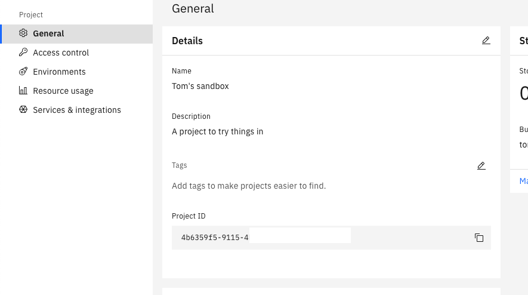

# API Connect AI gateway

## pre- work
the first step is to get a watsonx AI runtime instance on IBM cloud. <br>
for IBMers and Partners this can be obtained for demo and education purposes trough TechZone.
- go to https://techzone.ibm.com/collection/tech-zone-certified-base-images/journey-watsonx 
- in this collection make a resrvation for `watsonx.ai/.governance SaaS`
- Make a reservation, you will get an invite to an IBM cloud account

Now that we are in an account that has WatsonX governance
- create a new serviceid under https://cloud.ibm.com/iam/serviceids 
- generate an API key for that serviceid and note it down
-  open the watsonx studio and launch in watsonx  <br>
- create a sandbox project <br>
- under the manage tab, in the access control section add the service ID created earlier <br> 
- in the general section of the manage tab also make note of the projectID <br> 


## Setting up the AI gateway in API Connect

- First we create the AI gateway, in develop create a new API and select OpenAPI3 , here you select the AI gateway <br> 
- Select watsonx as the platform
- Give the API a title, description, ....
- in the next section we can either enter the API Key or you could put it in a catalog property (see the API Connect documentation) , also select the correct region<br> 
- In the next window enter the project id and rate limit details<br> 
- In the assemblies `ibm-cloud-authentication` policy add the key or make sure that the referenced variable is filled.
- now it's time to test the API, in the test tab click `target configuration` and enable auto-publish <br> 
- now in the test tab make a request with the following body 
``` 
{
	"model_id": "ibm/granite-13b-instruct-v2",
	"input": "Describe how to build a Node.js application",
	"parameters": {
		"max_new_tokens": 200,
		"time_limit": 5000
	}
}
```
we should get a response like this <br> 

## analytics
After you've tested the API a couple of time you can go to analyctics and open the AI Usage section.

 
